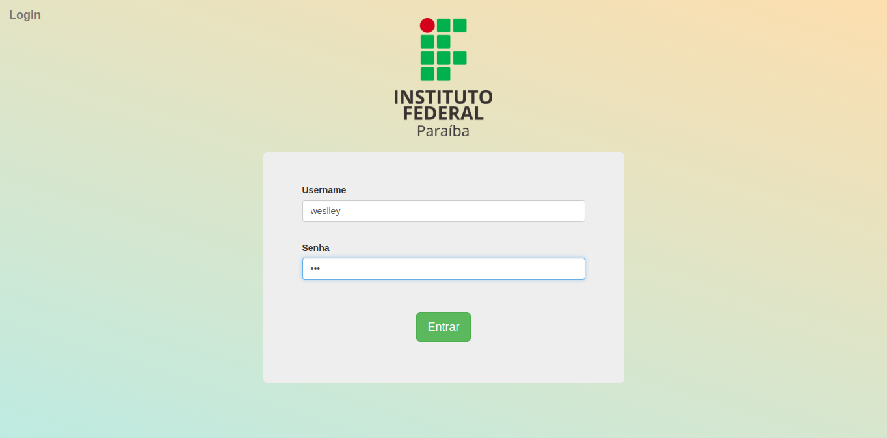
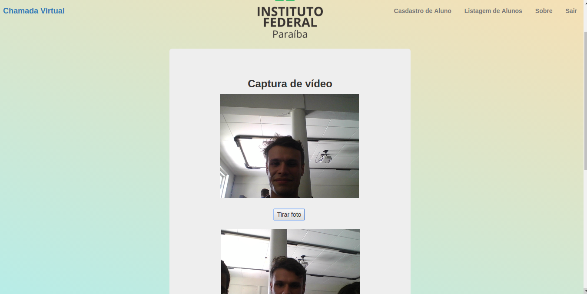
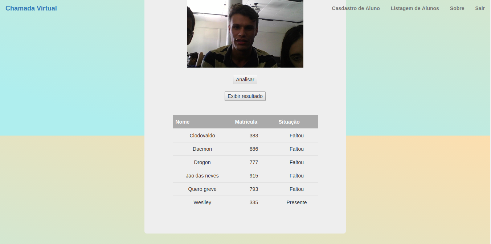
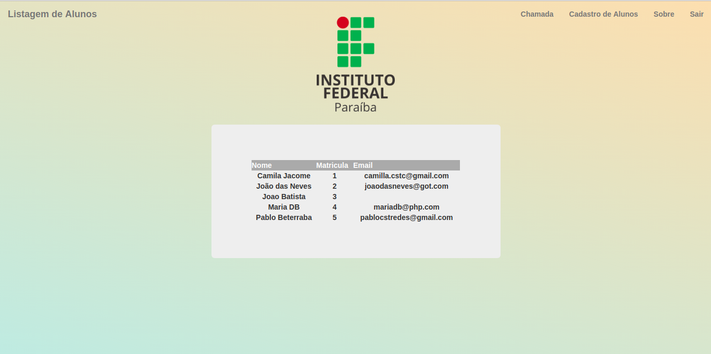
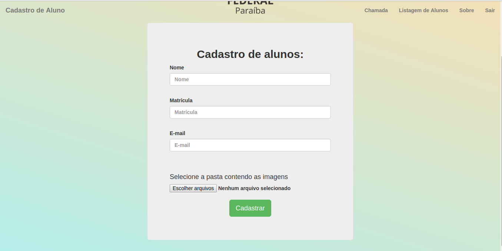
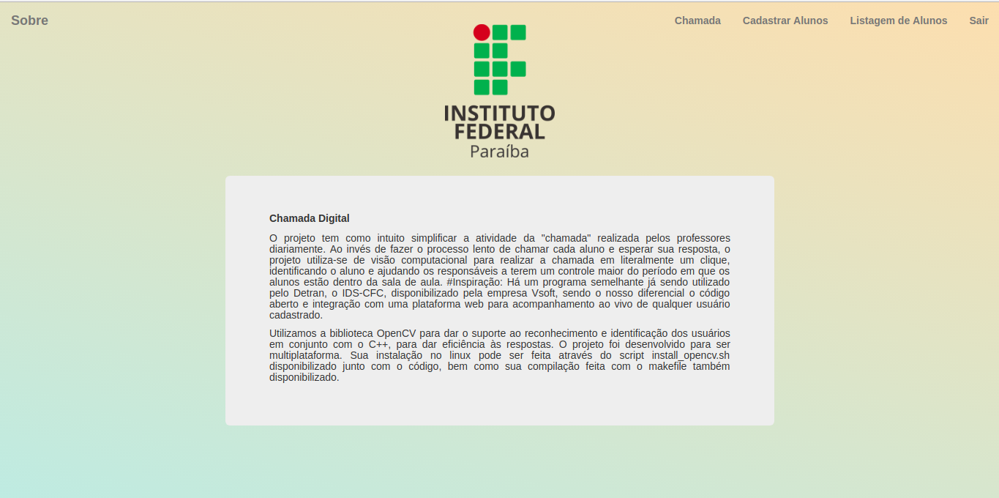

# Chamada Virtual

# Objetivo:
O projeto tem como intuito simplificar a atividade da "chamada" realizada pelos professores diariamente. Ao invés de fazer o processo lento de chamar cada aluno e esperar sua resposta, o projeto utiliza-se de visão computacional para realizar a chamada em literalmente um clique, identificando o aluno e ajudando os responsáveis a terem um controle maior do período em que os alunos estão dentro da sala de aula.
# Inspiração:
Há um programa semelhante já sendo utilizado pelo Detran, o IDS-CFC, disponibilizado pela empresa Vsoft, sendo o nosso diferencial o código aberto e integração com uma plataforma web para acompanhamento ao vivo de qualquer usuário cadastrado.

# Utilização

Utilizamos a biblioteca OpenCV para dar o suporte ao reconhecimento e identificação dos usuários em conjunto com o C++, para dar eficiência às respostas. O projeto foi desenvolvido para ser multiplataforma. Sua instalação no linux pode ser feita através do script install_opencv.sh disponibilizado junto com o código, bem como sua compilação feita com o makefile também disponibilizado.

# Screnshots

### Tela de login do aplicativo

### Tela principal

### Identificação do Usuário

### Lista de Alunos

### Tela de Cadastro

### Sobre

